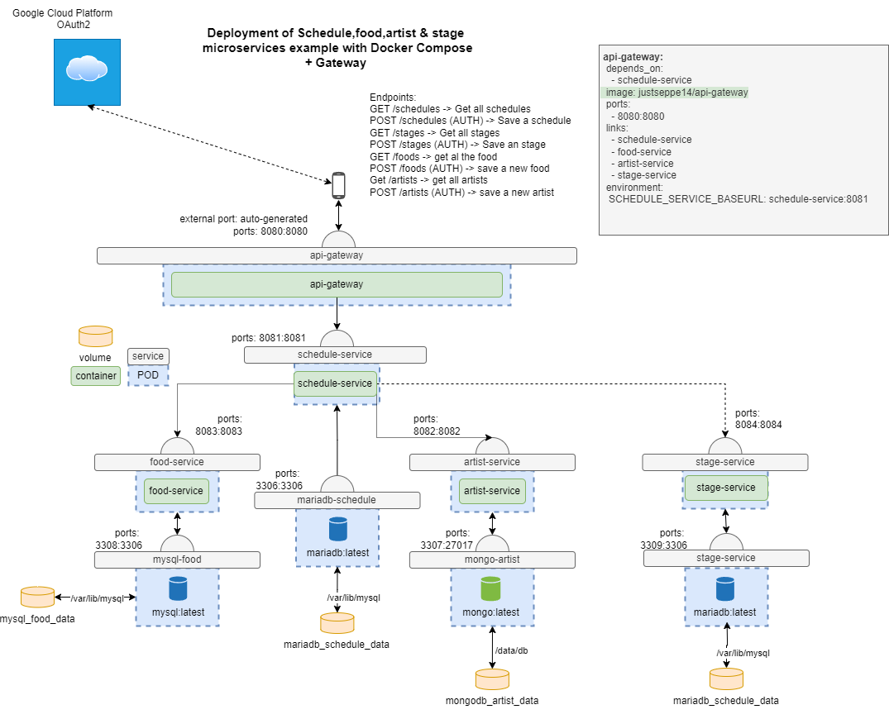

In this project, we create a Java system with microservices to run our application for a food truck festival: "FritFest"

Our Docker Compose architecture will look like this:

- `api-gateway`
- `schedule-service` (MariaDB db, main page/service, landing page)
- `artist-service` (MongoDB db for artists, view/register/edit artists)
- `food-service` (MySQL db, two tables: register/edit foodtrucks, register/edit food prices)
- `stage-service` (MariaDB db, manage stages: location, max. capacity, technical info)

---
## Installation
To get started, clone this repository and copy the `.env.template` file to `.env`. Then fill out the password values. Note that once the databases have been initialized, the passwords can not be changed.

Then run the following command:
```
docker compose up
```


--- 
## Schema

