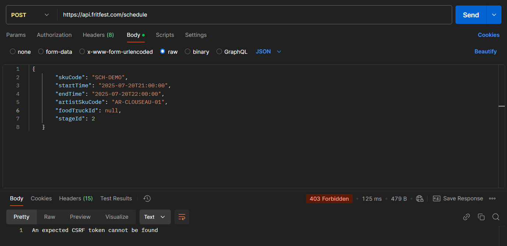
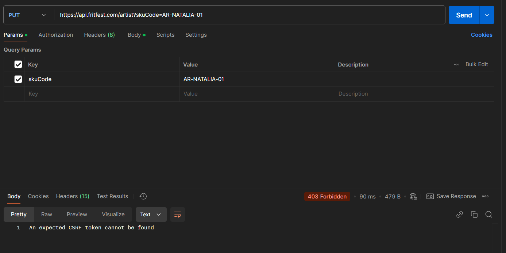
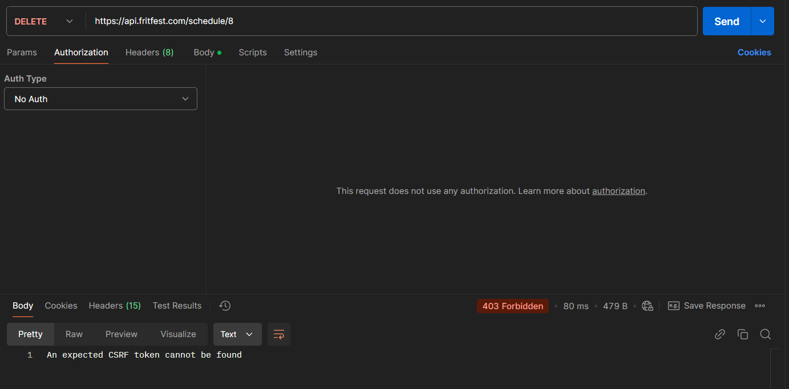
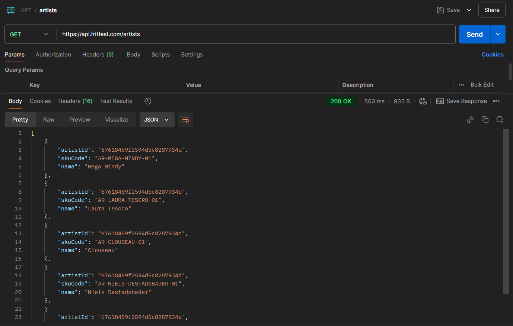
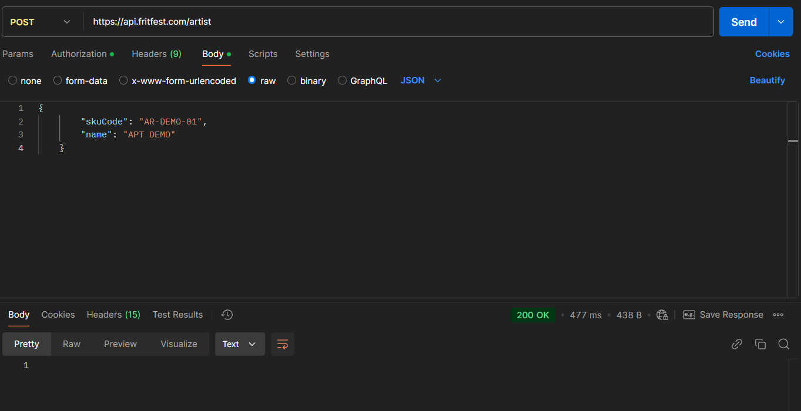
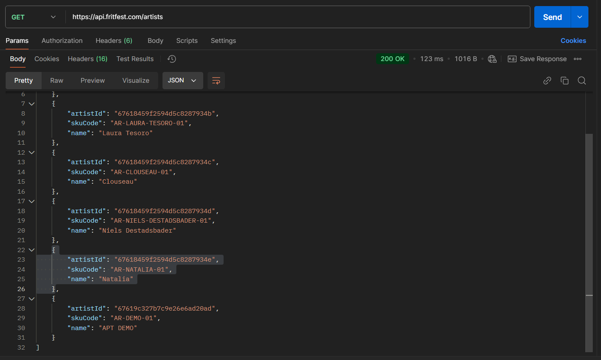
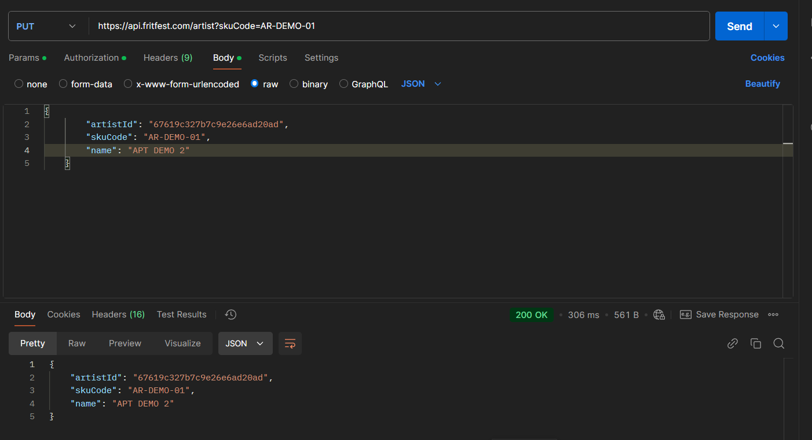
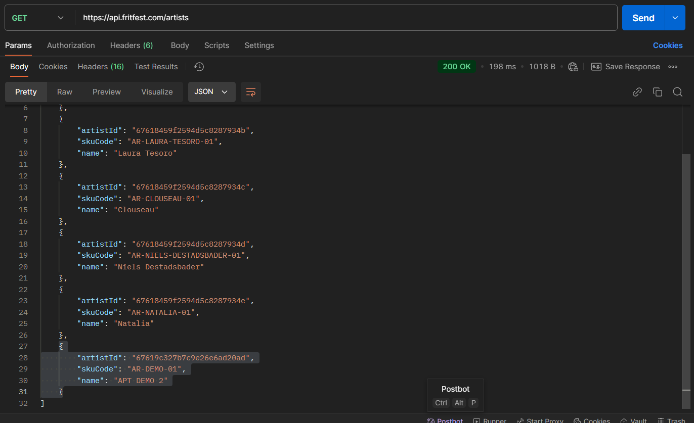
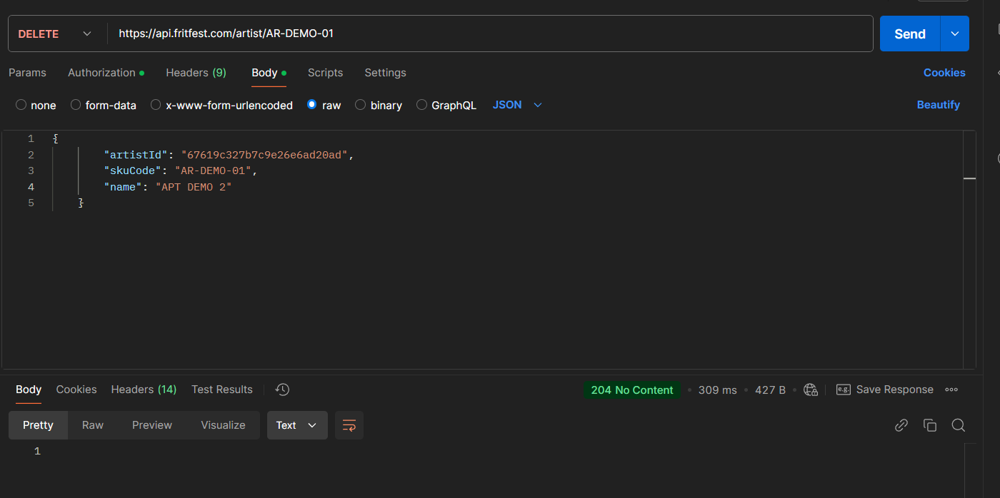
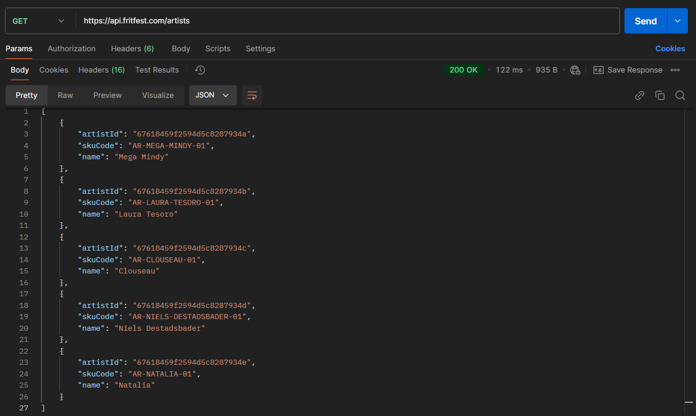

# FritFest
## Context
In dit project maken we een Java systeem met microservices om onze applicatie te runnen. We hebben voor dit thema gekozen omdat we beide van festivals houden.
We maken gebruiken van 4 microservices: artist, food, stage en schedule. 

---
## Docker
Onze docker-compose ziet er als volgt uit:

- `api-gateway`
- `schedule-service` (MariaDB db, main page/service, landing page)
- `artist-service` (MongoDB db for artists, view/register/edit artists)
- `food-service` (MySQL db, two tables: register/edit foodtrucks, register/edit food prices)
- `stage-service` (MariaDB db, manage stages: location, max. capacity, technical info)

---
## Microservices
Onze belangrijkste microservice is de Schedule-service. Hier komen de andere services allemaal in samen. We krijgen dus een overzicht van welke artist op welk podium speelt. Welke foodtrucks er zijn en hun food-items.
Voor deze service hebben we gekozen voor Mariadb. Dit hebben we gekozen omdat deze ongeveer dezelfde syntax heeft als een MySql database.

---
Hiernaast hebben we ook de artist-service. Via deze service kunnen we de opgeslagen artists raadplegen. Deze service maakt gebruik van de mongodb database.
We hebben hiervoor gekozen omdat deze makkelijker te schalen is. We kunnen dus makkelijk extra tabellen toevoegen.

---
Als 3de service hebben we de stage-service. Hier verzamelen we alle podia die we op ons festival hebben. Voor deze service hebben we Mariadb gebruikt als database.

---
Last but not least hebben we onze food-service. Dit is een speciale service. We zaten met het probleem dat we zowel foodtrucks als food-items wouden tonen in deze service. Dus we moeten met 2 tabellen gaan werken binnenin 1 service.
Dit heeft wel voor wat struggles gezorgd. Zo kwamen we steeds in een unending loop terecht door een verkeerde relatie. Maar na wat debug werk is dit opgelost geraakt.
Voor deze service maken we gebruik van een MySql database

---
## API-Gateway
De API-Gateway zorgt voor de beveiliging van onze applicatie. Deze is beveiligd via 0auth2 van google. Zo zorgen we ervoor dat enkel de admins data kunnen veranderen.
We hebben de /GET endpoints wel open gelaten zodat we deze standaard kunnen tonen op onze frontend. Als de andere endpoints zijn beveiligd.

---
## Installation
To get started, clone this repository and copy the `.env.template` file to `.env`. Then fill out the password values. Note that once the databases have been initialized, the passwords can not be changed.

Then run the following command:
```
docker compose up
```

--- 
## Schema
Hieronder vindt u ons technisch schema. Hier wordt weergegeven hoe de applicatie is opgesteld.
Er wordt ook getoond hoe de connectie is tussen de verschillende services.

---

## Werking van de endpoints
Al onze calls worden gedaan via `api.fritfest.com` dit hebben we voor extra veiligheid gedaan. De services zijn niet rechtstreeks beschikbaar.
Als je niet authenticated bent kan je ook geen _**POST**_, _**PUT**_ en **_DELETE_** requests doen. Dit wordt getoond in onderstaande screenshots:




Als je eenmaal een geldig token hebt kan je deze acties welk uitvoeren:


Voor de **_GETS_** heb je geen authentication nodig.

**Artists**
Via de endpoints /artists kan je al de artiesten opvragen. Dit zie je op de onderstaande screenshot:


Ook kunnen we een nieuwe artiest aanmaken:



Nu dat we een artiest hebben aangemaakt, merken we dat we iets willen aanpassen:

En hij is aangepast:


Als laatste willen we een artiest verwijderen:


